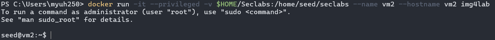
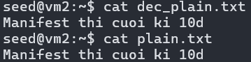

# Lab #2, 22110037, Nguyen Tien Huy, INSE330380E_01FIE
# Task 1: Transfer files between computers  
**Question 1**: 
Conduct transfering a single plaintext file between 2 computers, 
Using openssl to implementing measures manually to ensure file integerity and authenticity at sending side, 
then veryfing at receiving side. 

**Answer 1**:
## Before the lab
To make this lab works, I have prepare two virtual machine by running two docker containers at the same time:
### Virtual machine `vm1` (sender)

### Virtual machine `vm2` (receiver)


## Step to solve this problem
### 1. Prepare the plaintext file named `plain.txt`:
First, we write a message and save it in a text file:
```sh
echo "Manifest thi cuoi ki 10d" > plain.txt
```
Verify the newly created file <br>

### 2. Generate HMAC:
On sending machine, we generate a secret key to use for HMAC:
```sh
openssl rand -base64 32 > hmac.key
```
This will create a 32-byte secret key for HMAC. Follow it we will generate HMAC for the `plain.txt` file using SHA256 as the hash function:
```sh
openssl dgst -sha256 -hmac "$(cat hmac.key)" -out plain.hmac plain.txt
```
Here, plain.txt will be our input and hmac.key is our output.
### 3. Transfer the file and HMAC to the receiving machine:
In this step I choose netcat to transfer the file. First let send the `plain file` and `HMAC file` to `vm2`. Receive machine's IP is `172.17.0.3`.
*On sending side:*
```sh
cat plain.txt | nc 172.17.0.3 12345
```
```sh
cat plain.hmac | nc 172.17.0.3 12345
```
*On receiving side:*
```sh
nc -l -p 12345 > plain.txt
```
```sh
nc -l -p 12345 > plain.hmac
```
Result on `vm2`: <br>

### 4. Verify file integerity and authenticity at receiving machine:
After receiving the file and HMAC, the receiver needs to verify the authenticity and integrity of the file. We will do this by generate the HMAC for the received file using the same secret key as used by the sender:
```sh
openssl dgst -sha256 -hmac "$(cat hmac.key)" -out plain.hmac.received plain.txt
```
*Note that `hmac.key` should be shared by the sender*

Then compare them by
```sh
cmp plain.hmac plain.hmac.received
```
If cmp produce no output, it indicate that the files are identical <br>

 
# Task 2: Transfering encrypted file and decrypt it with hybrid encryption. 
**Question 1**:
Conduct transfering a file (deliberately choosen by you) between 2 computers. 
The file is symmetrically encrypted/decrypted by exchanging secret key which is encrypted using RSA. 
All steps are made manually with openssl at the terminal of each computer.

**Answer 1**:
In this task I will reuse the `plain.txt` file. To make it hybrid encryption I will use `AES` on sender side and `RSA` on receiver side

## Step to solve this problem
### 1. Generate keys on both machine:
On receiver machine, repeat these command to generate a RSA key pair. First is private key, follow by public key. Public key will be share with sender using method in taks 1:
```sh
openssl genpkey -algorithm RSA -out private_key.pem -aes256
```
```sh
openssl rsa -pubout -in private_key.pem -out public_key.pem
```
### 2. Encrypt the file on sender side:
Generate symmetric key for AES encryption:
```sh
openssl rand -out secret.key 32
```
Encrypt the file using AES encryption
```sh
openssl enc -aes-256-cbc -salt -in plain.txt -out plain.enc -pass file:./secret.key
```
### 3. Encrypt symmetric key with receiver's RSA public key:
```sh
openssl rsautl -encrypt -inkey public_key.pem -pubin -in secret.key -out secret.key.enc
```
### 4. Transfer the file to receiving machine:
By repeat with the same method in task 1, we will transfer the encrypted file and encrypted key to receiver:
```sh
cat plain.enc | nc 172.17.0.3 12345
```
```sh
cat secret.key.enc | nc 172.17.0.3 12345
```
```sh
nc -l -p 12345 > plain.enc 
```
```sh
nc -l -p 12345 > secret.key.enc
``` 
### 5. Decrypt the symmetric key by using RSA private key:
On receiver side, we decrypt the symmetric key by using receiver RSA's private key:
```sh
openssl rsautl -decrypt -inkey private_key.pem -in secret.key.enc -out decrypted_secret.key
```
### 6. Decrypt the received file using the decrypted symmetric key 
```sh
openssl enc -d -aes-256-cbc -in plain.enc -out dec_plain.txt -pass file:./decrypted_secret.key
```
### 7. Verify the decrypted file:


# Task 3: Firewall configuration
**Question 1**:
From VMs of previous tasks, install iptables and configure one of the 2 VMs as a web and ssh server. Demonstrate your ability to block/unblock http, icmp, ssh requests from the other host.

**Answer 1**:


