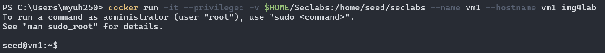

# Lab #2, 22110037, Nguyen Tien Huy, INSE330380E_01FIE
# Task 1: Transfer files between computers  
**Question 1**: 
Conduct transfering a single plaintext file between 2 computers, 
Using openssl to implementing measures manually to ensure file integerity and authenticity at sending side, 
then veryfing at receiving side. 

**Answer 1**:
## Before the lab
To make this lab works, I have prepare two virtual machine by running two docker containers at the same time:
### Virtual machine `vm1` (sender)

### Virtual machine `vm2` (receiver)


## Step to solve this problem
### 1. Prepare the plaintext file named `plain.txt`:
First, we write a message and save it in a text file:
```sh
echo "Manifest thi cuoi ki 10d" > plain.txt
```
Verify the newly created file

### 2. Generate HMAC:
On sending machine, we generate a secret key to use for HMAC:
```sh
openssl rand -base64 32 > hmac.key
```
This will create a 32-byte secret key for HMAC. Follow it we will generate HMAC for the `plain.txt` file using SHA256 as the hash function:
```sh
openssl dgst -sha256 -hmac "$(cat hmac.key)" -out plain.hmac plain.txt
```
Here, plain.txt will be our input and hmac.key is our output.
### 3. Transfer the file and HMAC to the receiving machine:
In this step I choose netcat to transfer the file. First let send the `plain file` and `HMAC file` to `vm2`. Receive machine's IP is `172.17.0.3`.
*On sending side:*
```sh
cat plain.txt | nc 172.17.0.3 12345
```
```sh
cat plain.hmac | nc 172.17.0.3 12345
```
*On receiving side:*
```sh
nc -l -p 12345 > plain.txt
```
```sh
nc -l -p 12345 > plain.hmac
```
Result on `vm2`:

### 4. Verify file integerity and authenticity at receiving machine:

 
# Task 2: Transfering encrypted file and decrypt it with hybrid encryption. 
**Question 1**:
Conduct transfering a file (deliberately choosen by you) between 2 computers. 
The file is symmetrically encrypted/decrypted by exchanging secret key which is encrypted using RSA. 
All steps are made manually with openssl at the terminal of each computer.

**Answer 1**:


# Task 3: Firewall configuration
**Question 1**:
From VMs of previous tasks, install iptables and configure one of the 2 VMs as a web and ssh server. Demonstrate your ability to block/unblock http, icmp, ssh requests from the other host.

**Answer 1**:


